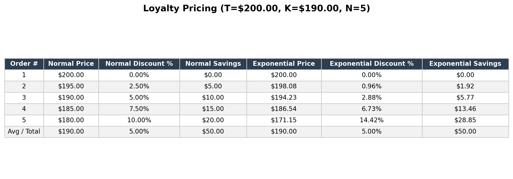

# Loyalty Discount Pricing Calculator

Calculates a gradual "hesitation-proof" discount ramp for loyal clients.

## The problem it solves

You sell a product at a normal price **T** (e.g. $200). A client wants a
loyalty price of **K** (e.g. $190), but you're not sure if they'll actually
keep ordering or just grab the discount once and disappear. Instead of
giving the full discount immediately, you ramp the price down gradually
over **N** orders — order `x` is priced at `P_x`, starting at `T` (order 1)
and ending at `K` (order N).

## Example: T=200, K=190, N=5

\


## Formulas

**Normal / Linear ramp:**
```
P_x = T - ((T - K) * (x - 1)) / (N - 1)
```

**Exponential ramp** (price stays close to T at first, then drops faster
towards the end, with the average of all orders equal to K):
```
P_x = T - (T - K) * N * (2^(x - 1) - 1) / (2^N - N - 1)
```

Where:
- `T` = normal (full) price
- `K` = target discounted / loyalty price
- `N` = total number of orders in the ramp
- `x` = the order number (1..N)

If `N = 1`, there's only one order, so it's simply priced at `T`.

## Install

You can easily install this package via `pip`:

```bash
pip install loyalty-pricing-calculator
```

- The **CLI** only needs `matplotlib` (for image and chart exports).
- The **GUI** additionally needs `tkinter`. This ships with most Python installs on Windows/macOS. On Debian/Ubuntu Linux, if it's missing:
  ```bash
  sudo apt install python3-tk
  ```

## Usage

### Desktop Application (GUI)

Since you installed it via `pip`, you can simply run:

```bash
loyalty-pricing
```

Enter `T`, `K`, `N`, pick a method (normal / exponential / both), click
**Calculate**, then use **Export Table Image (PNG)**, **Export Chart Image (PNG)** or **Export CSV** to
save the result.

### Command Line Interface (CLI)

You can run calculations directly from the terminal by passing the `--cli` flag:

```bash
loyalty-pricing --cli --T 200 --K 190 --N 5
loyalty-pricing --cli --T 200 --K 190 --N 5 --method exponential
loyalty-pricing --cli --T 200 --K 190 --N 5 --method both --csv table.csv --image table.png
```

Options:

| Flag         | Description                                          |
|--------------|-------------------------------------------------------|
| `--T`        | Normal price (required)                               |
| `--K`        | Target discounted price (required)                    |
| `--N`        | Number of orders in the ramp (required)                |
| `--method`   | `normal`, `exponential`, or `both` (default: `both`)   |
| `--csv PATH` | Save the table as a CSV file                           |
| `--image PATH` | Save the table as a PNG image                       |
| `--no-table` | Suppress printing the table to the console              |

### As a Python Module

You can also import it in your own Python scripts:

```python
from loyalty_pricing.core import generate_table

rows = generate_table(T=200, K=190, N=5, method="exponential")
```
